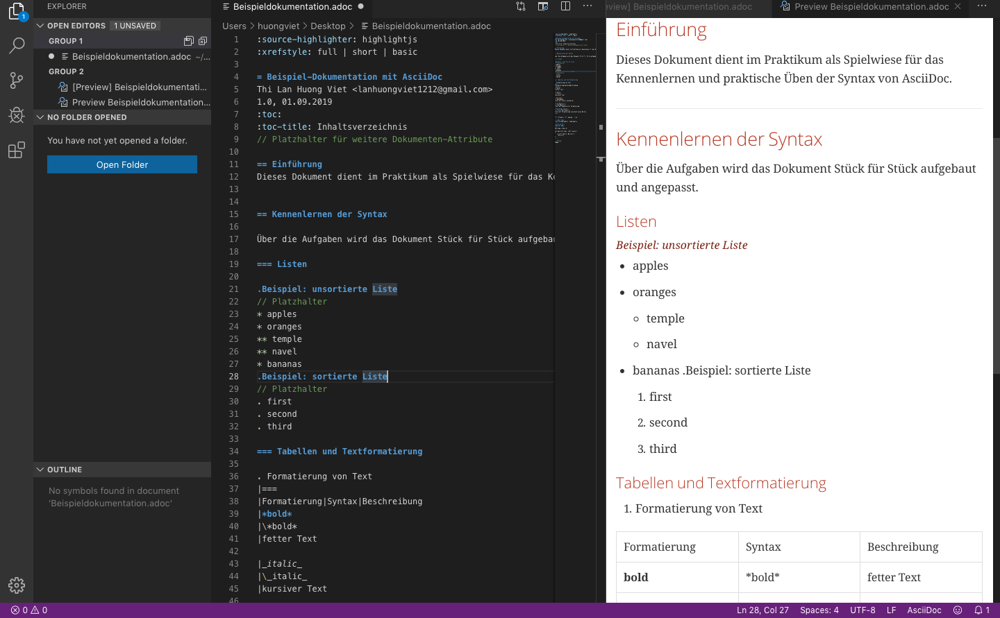

:source-highlighter: highlightjs
:xrefstyle: full | short | basic


= Beispiel-Dokumentation mit AsciiDoc 
Thi Lan Huong Viet <lanhuongviet1212@gmail.com> 
1.0, 01.09.2019 
:toc: 
:toc-title: Inhaltsverzeichnis
// Platzhalter für weitere Dokumenten-Attribute 

== Einführung
Dieses Dokument dient im Praktikum als Spielwiese für das Kennenlernen und praktische Üben der Syntax von AsciiDoc.

== Kennenlernen der Syntax

Über die Aufgaben wird das Dokument Stück für Stück aufgebaut und angepasst.

=== Listen

.Beispiel: unsortierte Liste 
// Platzhalter
* apples
* oranges
** temple
** navel
* bananas

.Beispiel: sortierte Liste
// Platzhalter
. first
. second
. third

=== Tabellen und Textformatierung

|===
|Formatierung|Syntax|	Beschreibung|

|*bold*
|\*bold*
|fetter Text

|_italic_
|\_italic_
|kurrsiver Text

|`monospace`
|\`monospace`
|Text mit fester Laufweiter

|*bold*&_italic_
|\*bold*&_italic_
|Text mit kombinierter Formatierung

|**bold**&__italic__
|\**bold**&__italic__
|Text mit Formatierung innerhalb eines Wortes
|===

**S**_ofware_ **E**__nginee__``ring```

=== Quellcode
.hello_world.c
[source,ruby]
----

#include <stdio.h>

int main(int argc, char* argv[])
{
    printf("Hello, World\n");
    return 0;
}

----

=== Bilder


=== Verweise
https://www.informatik.htw-dresden.de/~zirkelba/praktika/se/arbeiten-mit-git-und-asciidoc/praktikumsaufgaben-teil-2.html#title_asciidoc

